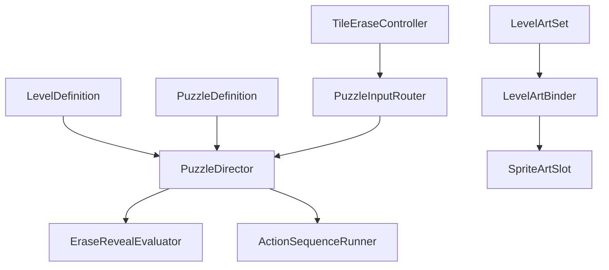

# Levels 1–5 — Unity Implementation Guide

## What is implemented

The project includes five independent portrait scenes, five `LevelDefinition` assets, five `PuzzleDefinition` assets, intro/success sequences, per-level `LevelArtSet` assets, reusable eraser-mask surfaces, HUD feedback, replay and next-level navigation. The user's supplied Ganesha is the canonical character reference; a transparent crawl sprite is bound in all five art sets. Other scene slots retain visible greybox fallbacks until their separate PNGs are approved.

Use:

```text
Tools → Bal Ganesha Game → Build First 5 Playable Levels
```

The command creates missing scenes, opens Level 1 and adds all five scenes to Build Settings. It preserves scenes that already exist, so it can be rerun to create missing data or the default character binding without replacing an artist's scene edits.

## Runtime separation



Gameplay correctness never depends on a sprite filename. Final artwork can change through `LevelArtSet` while the stable `SceneEntity` target IDs remain unchanged. `SceneRegistry` indexes every root in the loaded scene, including the sibling Level Content hierarchy used by success sequences.

## Generated content

| Content | Folder |
|---|---|
| Scenes | `Assets/_Project/Scenes/Chapters/C01/` |
| Level data | `Assets/_Project/Data/Levels/C01/` |
| Puzzle data | `Assets/_Project/Data/Puzzles/C01/` |
| Art binding data | `Assets/_Project/Data/Presentation/C01/` |
| Sequences | `Assets/_Project/Data/Sequences/C01/` |

## How to test the playable slice

1. Open the project in Unity `6000.0.84f1`.
2. Wait until the lower-right import spinner and Console compilation finish.
3. Select **Tools → Bal Ganesha Game → Build First 5 Playable Levels**.
4. Level 1 opens automatically.
5. Set the Game window to `1170 × 2532` portrait. Mobile devices use their native pixels while the UI scales from this reference.
6. Press Play.
7. Hold the left mouse button and rub across the blue target surface. On a phone, drag one finger.
8. After success, press **Next Level**. Complete Levels 1–5 in order.
9. Run **Tools → Bal Ganesha Game → Validate Project** and confirm zero errors.

## How to install final art without code changes

1. Import PNG exports into the matching `Assets/_Project/Art/.../Export` folder. Use the exact slot names in the art prompt pack.
2. Use Sprite (2D and UI), sRGB on, alpha transparency on, mipmaps off.
3. Open the matching `ART_C01_00N` asset in `Assets/_Project/Data/Presentation/C01/`.
4. Add a binding whose `slotId` exactly matches the prompt-pack slot.
5. Assign the sprite. Use a white tint and leave `useNativeSize` off. `SpriteArtSlot` fits the sprite into the authored world-space box while preserving aspect ratio; final composition still needs visual review.
6. Enter Play Mode. `LevelArtBinder` replaces the colored fallback while puzzle IDs, colliders and sequences stay unchanged.

The interactive cover for each level is one full transparent PNG. The eraser uses a grid of `SpriteMask` cells, so the art does not need to be manually sliced.

## Stable target IDs

| Level | Correct eraser entity |
|---|---|
| 1 | `ENT_C01_001_Rope_Target` |
| 2 | `ENT_C01_002_Spill_Target` |
| 3 | `ENT_C01_003_CupboardDoor_Target` |
| 4 | `ENT_C01_004_LightWeight_Target` |
| 5 | `ENT_C01_005_LowerCover_Target` |

Do not rename these IDs after art integration. Art-slot IDs may be rebound to new sprites; gameplay IDs are the save/test contract.

## Current visual scope

The committed scenes are colored, readable production greybox compositions with one illustrated Ganesha crawl pose—not final painted environments and props. All five levels have the erase target, success sequence, replay and next-level navigation. Unity EditMode tests, the PlayMode test that completes all five scenes, and the project validator pass. Touch-device play, final character animation, sound events, localization and performance tuning remain integration work after approved art arrives.
